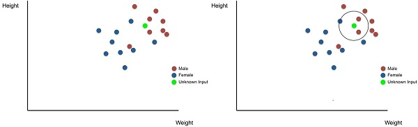

# All about AI from Applied AI
> *The content below is taken as notes from Applied AI course.*

## Table of contents

* [Classifications (KNN)](#classifications-knn)
* [Pedia](#pedia)

## Classifications (KNN)
 - [What is classification?](#what-is-classification)
 - [Regression](#regression)
 - [Classification & Regression ](#classification--regression)
 - [KNN](#knn)
 - [Distance measure in KNN](#distance-measure-in-knn)
 - [KNN Limitations](#knn-limitations)
 - [Calculating effectivines/accuracy of KNN](#calculating-effectivines/accuracy-of-knn)

## Classifications (KNN)

### What is classification
Classification is a type of supervised learning. Classification is the process of predicting the class of given data points. Classes are sometimes called as targets/ labels or categories. An example is classifying emails as “spam” or “not spam.”

Here you have input variables (x) and an output variable (Y) and you use an algorithm to learn the mapping function from the input to the output Y = f(X) . The goal is to [approximate the mapping function](#approximate-function) so well that when you have new input data (x) that you can predict the discrete output variables (Y) for that data.

In other words Y = f(X) can be represented as **model = algorithm(data)**
where model is class label, algorithm is [approximate Function](#approximate-function), data is input 

### What is Regression
It is similar to classification only thing varies is instead of predicting discrete variable will do continous variables. An example is regression on students height in a class room.

The task of approximating a mapping function (f) from input variables (X) to a continuous output variable (y).

### Classification vs Regression
* Difference betwwen them is as follows

    |Classification|Regression|
    |-|-|
    |It is about predicting a label | It is about predicting a quantity|
    |Predection on Discrete values |Predection on Continuous values|
    |We try to find the decision boundary, which can divide the dataset into different classes.| We try to find the best fit line, which can predict the output more accurately.|

### KNN
K Nearest Neighbors or KNN Algorithm is a simple algorithm which uses the entire dataset in its training phase. Whenever a prediction is required for an unseen data instance, it searches through the entire training dataset for k-most similar instances and the data with the most similar instance is finally returned as the prediction. 

### Distance measure in KNN

### KNN Limitations

### Calculating effectivines/accuracy of KNN

## Pedia
 - [Approximate Function](#approximate-function)
 - majority vote
 - predictive modelling 
 - model interpretability

## Pedia

#### Approximate Function

It means finding a value nearly equal​ to the actual value of the function at a point or at a set of points. 

