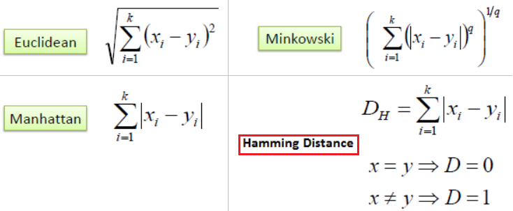

# All about AI from Applied AI
> *The content below is taken as notes from Applied AI course.*

## Topics List
1. Foundations of Natural Language Processing and Machine Learning
2. [Pedia](#pedia)

## Table of contents

1. Foundations of Natural Language Processing and Machine Learning
    * [Classifications and Regression](#classifications-and-regression)

## Classifications and Regression
 - [What is classification?](#what-is-classification)
 - [Regression](#regression)
 - [Classification & Regression ](#classification--regression)
 - [KNN](#knn)
 - [Distance measure in KNN](#distance-measure-in-knn)
 - [Calculating effectivines/accuracy of KNN](#calculating-effectivines/accuracy-of-knn)
 - [KNN Limitations](#knn-limitations)
 - [What is K and NN](#what-is-k-and-nn)
 - [Decision surface for KNN]
 - [Fitting Techniques]
 - [Training and Testing DataSet]
 - [Cross Validation]
 - [K-fold Cross Validation]
 - [Accuracy rate and Training Error]
 - [Train, CV, Test DataSet]
 - [Training and Cross Validation error]
 - [Generalization Accuracy]
 - [Time and Random Based Splitting]
 - [KNN for regression]
 - [Weighted KNN]
 - [Voronoi Diagram]
 - [KD Tree]
 - [Nearest Neighbor Search in KD Tree]
 - [Limitations of KD Tree]
 - [Cosine Distance and Similarity]
 - [Hashing vs LSH]
 - [LSH for cosine similarity]
 - [LSH for euclidean distance]
 - [Probabilistic Class Label]

## Classifications (KNN)

### What is classification
Classification is a type of supervised learning. Classification is the process of predicting the class of given data points. Classes are sometimes called as targets/ labels or categories. An example is classifying emails as “spam” or “not spam.”

Here you have input variables (x) and an output variable (Y) and you use an algorithm to learn the mapping function from the input to the output Y = f(X) . The goal is to [approximate the mapping function](#approximate-function) so well that when you have new input data (x) that you can predict the discrete output variables (Y) for that data.

In other words Y = f(X) can be represented as **model = algorithm(data)**
where model is class label, algorithm is [approximate Function](#approximate-function), data is input 

### What is Regression
It is similar to classification only thing varies is instead of predicting discrete variable will do continous variables. An example is regression on students height in a class room.

The task of approximating a mapping function (f) from input variables (X) to a continuous output variable (y).

### Classification vs Regression
* Difference betwwen them is as follows

    |Classification|Regression|
    |-|-|
    |It is about predicting a label | It is about predicting a quantity|
    |Predection on Discrete values |Predection on Continuous values|
    |We try to find the decision boundary, which can divide the dataset into different classes.| We try to find the best fit line, which can predict the output more accurately.|

### KNN
K Nearest Neighbors is a simple algorithm which uses the entire dataset in its training phase. Whenever a prediction is required for an unseen data instance, it searches through the entire training dataset for k-most similar instances  by a majority vote of its neighbors and the data with the most similar instance is finally returned as the prediction. 

### Distance measure in KNN
* The algorithm calculates the distance of a new data point to all other training 
* The algorithm then selects the k-nearest data points, where k can be any integer.
* Finally, it assigns the data point to the class where similar data points lie.

* Distance measures is as follows:
    * Euclidean distance(L2 Norm) : Calculates between a new point (x) and an existing point (xi) across all input attributes j.
    * Hamming Distance(Boolean): Calculate the distance between binary vectors 
    * Manhattan Distance(L1 Norm): Calculate the distance between real vectors using the sum of their absolute difference.
    * Minkowski Distance(L*p* norma): Generalization of Euclidean and Manhattan distance.
 > Calculate distance > Find closest neighbors > Vote for label
 

### Calculating effectivines/accuracy of KNN
* Evaluate the accuracy of the model is to calculate a ratio of the total correct predictions out of all predictions made.
* Accuracy will lies between 0 - 1, this later needs to be caluclated in %.

### KNN Limitations
Time complexity is O(dMNlog(k)) where d is the dimension of the data M the size of training data and N the size of test data. Alternatively K-D tree reduce the computational cost.

### What is K and NN

k is just the number of neighbors based on majority voting which are nearest.

 In general, practice, choosing the value of k is k = sqrt(N) where N stands for the number of samples/datapoints in your training dataset.

 So if your training set is 10,000 records, then the k value should be set to sqrt(10000) or 100.

If the total amount of records you have is 10,000 and you choose to split this data 70/30 between training and test sets respectively, then your k value will be sqrt(7000) or 84.

To select the K that’s right for your data, we run the KNN algorithm several times with different values of K and choose the K that reduces the number of errors we encounter while maintaining the algorithm’s ability to accurately make predictions when it’s given data it hasn’t seen before.
Here are some things to keep in mind:
- As we decrease the value of K to 1, our predictions become less stable. Just think for a minute, imagine K=1 and we have a query point surrounded by several reds and one green (I’m thinking about the top left corner of the colored plot above), but the green is the single nearest neighbor. Reasonably, we would think the query point is most likely red, but because K=1, KNN incorrectly predicts that the query point is green.
- Inversely, as we increase the value of K, our predictions become more stable due to majority voting / averaging, and thus, more likely to make more accurate predictions (up to a certain point). Eventually, we begin to witness an increasing number of errors. It is at this point we know we have pushed the value of K too far.
- In cases where we are taking a majority vote (e.g. picking the mode in a classification problem) among labels, we usually make K an odd number to have a tiebreaker.

### Decision surface for KNN

### Fitting Techniques

### Cross Validation
https://www.ritchieng.com/machine-learning-cross-validation/
Another way to choose K is though cross-validation. One way to select the cross-validation dataset from the training dataset. Take the small portion from the training dataset and call it a validation dataset, and then use the same to evaluate different possible values of K. This way we are going to predict the label for every instance in the validation set using with K equals to 1, K equals to 2, K equals to 3.. and then we look at what value of K gives us the best performance on the validation set and then we can take that value and use that as the final setting of our algorithm so we are minimizing the validation error .

### K-fold Cross Validation

### Accuracy rate and Training Error

### Training, CV and Testing DataSet
https://datascience.stackexchange.com/questions/36773/may-the-training-set-and-validation-set-overlap/36774

### Training and Cross Validation error

### Generalization Accuracy

### Time and Random Based Splitting

### KNN for regression

### Weighted KNN

### Voronoi Diagram

### KD Tree

### Nearest Neighbor Search in KD Tree

### Limitations of KD Tree

### Cosine Distance and Similarity

### Hashing vs LSH

### LSH for cosine similarity

### LSH for euclidean distance

### Probabilistic Class Label

## Pedia
 - [Approximate Function](#approximate-function)
 - majority vote
 - predictive modelling 
 - model interpretability
 -  feature scaling (standardization and normalization) 
 - hyperparameter tuning
 - Data Point Overlapping
 - Region Overlapping
 - Disjoint Datasets
 - lower variance but increased bias
 

## Pedia

#### Approximate Function

It means finding a value nearly equal​ to the actual value of the function at a point or at a set of points. 
